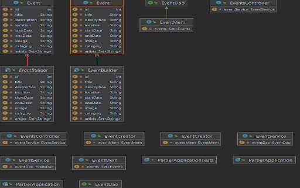

# Partier

## What is Partier?

 - Partier is on online platform that can be used for booking tickets to different types of events like festival, concerts, private parties and much more.

## Features:

### Implemented:
 
- There is a main page where all events are displayed on cards
- There is a countdown timer on the main page for a specific event
- Users can register as customers or organizers
- Organiser accounts need to be approved by the admin
- Organizers can add events that become active after admin approval
- Customers can buy tickets with credit card (Implemented with Stripe)
- APIs are secured with JWT

### Missing:

- On every event are displayed which users are participating
- Users can upload profile pictures
- Users can add friends
- Users can search for events

## Technologies used:

- Spring Boot
- Spring Security
- JWT
- Stripe
- Jpa
- PostgreSQL
- ReactJS
- Bootstrap

## Classes Diagram Picture

